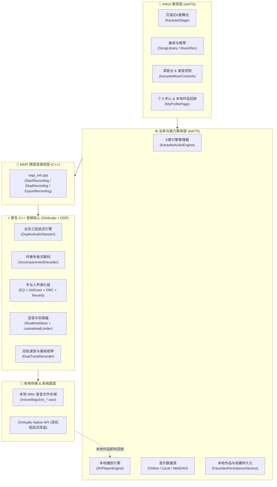
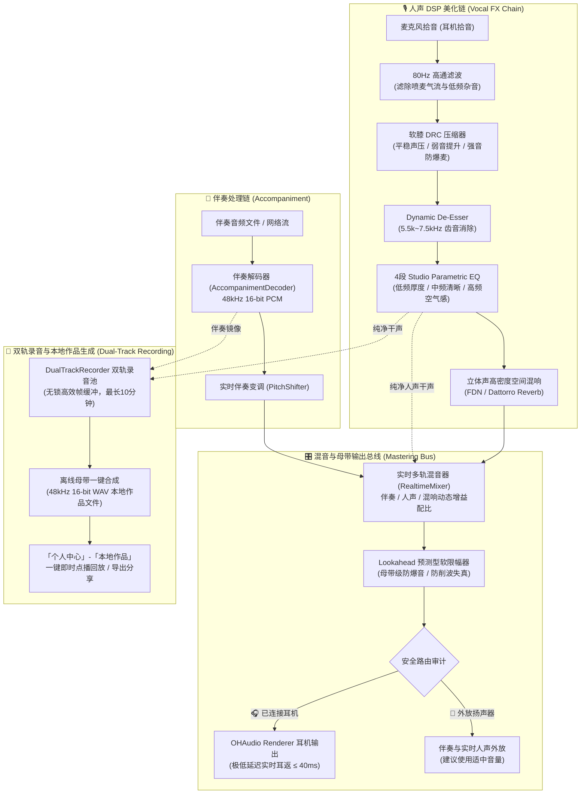

# PivoMic (皮沃麦克) 🎙️

<p align="center">
  <strong>基于 HarmonyOS NEXT (API 24) 的全场景跨端高保真个人 K 歌音频引擎与沉浸式音乐舞台</strong>
</p>

<p align="center">
  
  
  
  
  
  
</p>

---

## 🌟 项目简介

**PivoMic** 是一款专为 HarmonyOS 开发的跨终端高保真个人 K 歌应用。针对传统手机 K 歌“耳返延迟明显、人声单薄干瘪、多端（手机/电视/车机/平板）横竖屏撕裂”等痛点，PivoMic 自研了**原生极低延迟全双工 C++ DSP 音频引擎**。

> [!IMPORTANT]
> **使用说明**：PivoMic 同时支持耳机与无耳机 K 歌。连接有线或 USB/Type-C 耳机时开启低延迟实时耳返；使用扬声器时输出伴奏与处理后的实时人声；蓝牙输出仍关闭实时人声返听以避免高延迟语阻。外放时请避免音量过高或让麦克风靠近扬声器，以降低声学反馈风险。

---

## 📸 应用界面预览

<div align="center">

| 1. 发现与精选推荐 | 2. 沉浸式 K 歌舞台 | 3. 个人中心与本地作品库 |
| :---: | :---: | :---: |
|  |  |  |
| **多源精选歌单与曲库搜索**<br/>实时聚合、无损解析与多分类榜单 | **3D 舞台与手势切歌**<br/>上下滑动切歌、动态 LRC 歌词与低延迟耳返 | **本地录音作品管理与即时回放**<br/>48kHz 录音作品库、一键播放与本地导入 |

</div>

---

## 🚀 核心特性

### 1. 🎙️ 原生高保真 K 歌 DSP 处理引擎 (`OHAudio` + C++20)
- **极低延迟硬件级耳返**：基于 OHAudio 独占全双工采集与渲染流，伴奏与麦克风共用输出时钟，物理链路端到端延迟低至 $\le 40\text{ ms}$（Fast 模式约 $25\text{ ms}$），真正实现“歌声同步进耳”。
- **专业级人声美化流水线 (Vocal FX Chain)**：
  - **80Hz 高通滤波**：滤除喷麦气流与低频轰鸣杂音；
  - **动态 De-Esser**：毫秒级自适应压制人声中高频（5.5kHz ~ 7.5kHz）刺耳齿音；
  - **4 段录音室参数均衡器 (Parametric EQ)**：精准调校人声低频厚度、中频清晰度与高频空气感；
  - **软膝 DRC 动态范围压缩器**：平稳人声声压，弱音提升、强音防爆麦；
  - **高密度立体声空间混响 (FDN / Dattorro Reverb)**：提供多种房间/音乐厅预设，干湿比实时无缝调节；
  - **伴奏实时升降调 (`Pitch Shifter`) 与人声音高纠偏 (`Pitch Corrector`)**。
- **母带级安全限幅**：集成 Lookahead 预测型软限幅器 (Soft Limiter)，彻底杜绝数字削波失真与爆音。

### 2. 🔴 K 歌实时双轨录音与本地作品即时回放
- **底层无锁双轨录制**：在 C++ 音频渲染回调中，无损独立捕获**纯净人声干声**与**立体声伴奏轨**，零内存分配开销，支持长达 10 分钟连续录音。
- **离线母带合成与 WAV 导出**：演唱结束一键触发离线母带混音引擎，自动完成增益配比并生成 48kHz 16-bit 立体声无损 WAV 音频文件。
- **本地作品库即时点播回放**：
  - 录音完成后自动收录至「个人中心」-「本地作品」库，带有时长、时间戳与歌曲元数据；
  - 随时随地**在本地一键点播回放自己的演唱作品**，支持精确进度跳转与音量调节；
  - 提供本地录音批量管理、自定义存储目录修改与外部导出分享功能。

### 3. 📱 全场景跨端自适应架构 (Phone / Foldable / Tablet / TV / PC)
- **智能屏幕拓扑识别**：基于 `displayId` 拓扑与 `Aspect Ratio`，解决手机投屏/无线流转至电视时 `deviceType` 虚拟化导致的横竖屏误判问题。
- **多端响应式布局**：
  - **手机竖屏**：单手底部 TabBar 触控与沉浸式浮动卡片舞台；
  - **TV / PC / 2in1 宽屏**：左侧沉浸式 NavigationRail 侧边栏与 100% 满屏无黑边剧院模式；
  - **折叠屏 / 平板**：依据窗口宽高比实时自适应切换双列排版。

### 4. 🎵 沉浸式 K 歌舞台与曲库生态
- **3D 舞台视觉**：封面立体悬浮粒子动效、垂直滑动手势切歌过渡动效。
- **同步歌词渲染器**：支持标准 LRC 与逐字增强型 LRC，以音频 Renderer 已输出帧数为主时钟，毫秒级精准对齐。
- **多源音乐生态**：
  - 本地音频无缝导入（MP3、FLAC、WAV，系统 FilePicker）；
  - 在线聚合搜索与每日推荐热歌榜；
  - 高性能 LRU 本地音频与封面多级缓存；
  - WebDAV 个人私有云音乐源扩展支持。

### 5. 🛡️ 智能音频路由安全与隐私策略
- **双路由安全策略**：
  - **有线耳机 / USB (Type-C) 耳机**：自动激活低延迟监听与人声耳返；
  - **蓝牙耳机**：伴奏正常输出，关闭实时人声耳返以避免高延迟语阻，人声仍持续处理与录音；
  - **外放扬声器**：支持内置麦克风 K 歌、处理后人声实时外放与双轨录音；建议使用适中音量以降低声学反馈风险。
- **隐私保护**：麦克风录音权限仅在用户显式点击“开始演唱”时请求；应用切后台自动挂起采集，回到前台不静默重启。
- **长时后台任务适配**：集成 HarmonyOS Continuous Task，锁屏或切后台时伴奏播放平滑无阻断。

---

## 🏛️ 系统架构设计

### 1. 软件分层架构



---

### 2. 原生专业 K 歌与录音实时处理流水线



---

## 📂 代码工程结构

```text
PivoMic/
├── AppScope/                     # 全局应用配置与图标资源
├── docs/                         # 技术架构设计与调研文档
│   ├── multi_device_orientation_and_layout_adaptation.md # 多端与投屏自适应方案
│   ├── mobile_no_mic_karaoke_survey.md                # 业界音频方案调研报告
│   └── no_mic_karaoke_research.md                     # 声学特性测试与推导
├── entry/                        # 主功能模块
│   └── src/main/
│       ├── cpp/                  # ⚡ 原生 C++ 音频引擎
│       │   ├── karaoke/          # DSP 处理核心 (EQ, Reverb, Mixer, Decoder, Limiter, DualRecorder)
│       │   ├── tests/            # 28+ C++ 单元测试用例 (含双轨录音与离线母带测试)
│       │   ├── napi_init.cpp     # ArkTS NAPI 交互层
│       │   └── CMakeLists.txt    # 原生 CMake 构建配置
│       ├── ets/                  # 🎨 ArkTS 业务与 UI 模块
│       │   ├── audio/            # 音频会话管理、后台长时任务、耳机安全路由、AVPlayer 本地回放
│       │   ├── components/       # UI 组件 (K歌舞台、歌词、调音台、个人中心本地作品库)
│       │   ├── domain/           # 领域模型定义 (Song, Lyric, PlayQueue, Config)
│       │   ├── pages/            # 页面入口 (Index, Stage, Profile, Library)
│       │   ├── services/         # 在线/本地音乐源、LRC解析器、持久化服务
│       │   ├── store/            # 全局响应式状态管理 (AppStore)
│       │   └── theme/            # 样式与设计系统变量
│       ├── resources/            # 多语言与布局媒体资源
│       └── module.json5          # 模块权限与能力声明
└── scripts/                      # 🛠️ 自动化测试与实机验收脚本
    ├── device_karaoke_qa.sh      # 交互式实机 QA 巡检脚本
    └── test_device_karaoke_qa_parser.sh
```

---

## 🛠️ 构建与开发指南

### 1. 开发环境要求
- **IDE**：DevEco Studio 6.1.1 Release 或更高版本
- **HarmonyOS SDK**：API 24 (HarmonyOS NEXT)
- **编译工具链**：CMake 3.28+、hvigor 5.0+、Clang/LLVM
- **支持架构**：`arm64-v8a`（推荐目标真机）、`x86_64`（仅模拟器）

---

### 2. 快速编译与打包

#### 编译整个工程并生成未签名 HAP：
```bash
DEVECO_SDK_HOME=/Applications/DevEco-Studio.app/Contents/sdk \
  /Applications/DevEco-Studio.app/Contents/tools/hvigor/bin/hvigorw \
  --mode project -p product=default -p buildMode=debug assembleApp
```

#### 编译并执行 ArkTS 模块单元测试：
```bash
DEVECO_SDK_HOME=/Applications/DevEco-Studio.app/Contents/sdk \
  /Applications/DevEco-Studio.app/Contents/tools/hvigor/bin/hvigorw \
  --mode module -p module=entry@default -p product=default test
```

---

### 3. C++ 原生 DSP 单元测试 (Native Tests)

本地宿主机使用 CMake 与 CTest 运行 28+ 原生算法测试（包含混响、均衡器、变调、限幅器、双轨录音与离线母带）：

```bash
# 1. 配置 CMake 测试工程
/Applications/DevEco-Studio.app/Contents/sdk/default/openharmony/native/build-tools/cmake/bin/cmake \
  -S entry/src/main/cpp/tests -B /tmp/pivomic-native-tests

# 2. 编译测试二进制
/Applications/DevEco-Studio.app/Contents/sdk/default/openharmony/native/build-tools/cmake/bin/cmake \
  --build /tmp/pivomic-native-tests

# 3. 运行测试套件
/Applications/DevEco-Studio.app/Contents/sdk/default/openharmony/native/build-tools/cmake/bin/ctest \
  --test-dir /tmp/pivomic-native-tests --output-on-failure
```

---

### 4. 实机自动化测试与功能验收

通过 `hdc` 连接 HarmonyOS 真机后，运行自动化探针与全流程 QA 巡检：

```bash
# 检查设备连接与权限探针 (无设备时自动 SKIP)
scripts/device_karaoke_qa.sh --probe

# 执行交互式实机端到端功能验收
scripts/device_karaoke_qa.sh --run
```

---

## 📑 架构文档导航

更多深度设计说明与工程规范，请查阅 [docs/](docs/) 目录下的专题文档：

- 📱 [全场景多端横竖屏与布局自适应架构](docs/multi_device_orientation_and_layout_adaptation.md)：手机、智慧屏、折叠屏、车机与投屏拓扑识别方案。
- 🔬 [移动端音频声学与架构调研报告](docs/mobile_no_mic_karaoke_survey.md)：主流 K 歌竞品算法架构对比与声学实验数据。
- 📊 [声学特性测试与推导研究](docs/no_mic_karaoke_research.md)：音频处理算法与声学特性实验。

---

## ⚖️ 免责声明与许可

- 本项目在线音乐搜索与音频解析功能依赖用户配置的聚合接口服务；服务可用性、内容授权与版权均由服务提供方与使用者自行承担。
- 应用本身不内置任何受版权保护的音频文件。
- WebDAV 仅用于访问用户拥有合法授权的个人云端存储资源。
